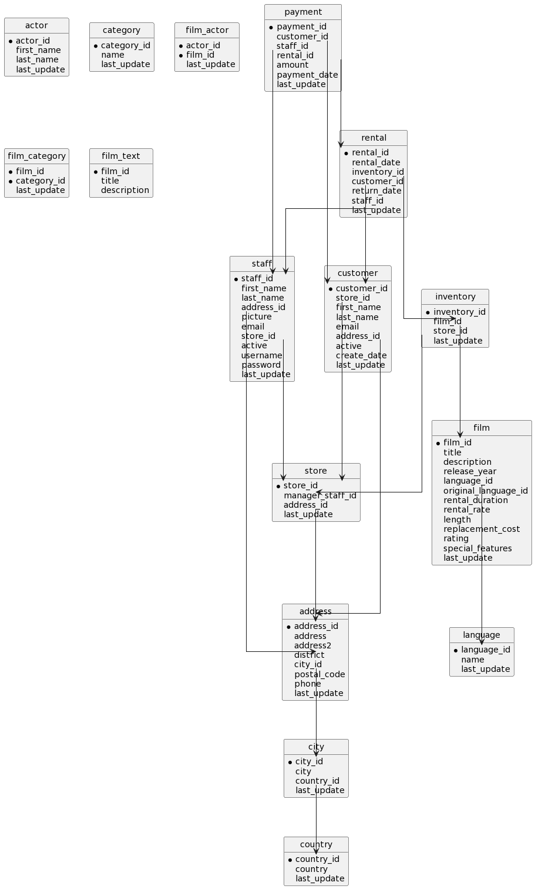

[](https://github.com/youngkiu/schema-to-erd/actions/workflows/eslint.yml)
[](https://github.com/youngkiu/schema-to-erd/actions/workflows/node.js.yml)
[](https://github.com/youngkiu/schema-to-erd/actions/workflows/npm-publish.yml)

[](https://badge.fury.io/js/schema-to-erd)
[](http://www.npmtrends.com/schema-to-erd)

# schema-to-erd
Generate ERD UML file from Schema DDL file

## Installation

```sh
$ npm i schema-to-erd
```

## Usage

```js
import { schemaToErd } from 'schema-to-erd';
// or:
const { schemaToErd } = require('schema-to-erd');

schemaToErd('./schema_samples/sakila-schema.sql');
```

```shell
$ schema2erd -s ./schema_samples/sakila-schema.sql
// or:
$ npx schema-to-erd -s ./schema_samples/sakila-schema.sql
```

### Sample Schema files

1. [Sakila Sample Database](https://dev.mysql.com/doc/index-other.html)
2. [Employees Sample Database](https://dev.mysql.com/doc/employee/en/) - https://github.com/datacharmer/test_db
3. [MySQL Sample Database](https://www.mysqltutorial.org/mysql-sample-database.aspx) - https://www.mysqltutorial.org/wp-content/uploads/2018/03/mysqlsampledatabase.zip
4. https://github.com/ronaldbradford/schema



## Source Codes

### Clone
```shell
$ git clone https://github.com/youngkiu/schema-to-erd.git
$ git submodule update --init --recursive
```

### Contribute
If an error occurs during use, please [open a new issue](https://github.com/youngkiu/schema-to-erd/issues) with the schema.sql file.

### Reference for package

- https://youtu.be/ZINPuzq62lE
- https://youtu.be/V_5ImTOmMh0
- https://github.com/joeythelantern/Component-Library
